# Costy - group expenses managing app written in Flutter <!-- omit in toc -->

This is a rework of an Android app I wrote some time ago. This time written in Flutter and improved. I used it as my Flutter playground.

- [Functionality](#functionality)
- [Some screenshots](#some-screenshots)
  - [Android light theme](#android-light-theme)
  - [Android dark theme](#android-dark-theme)
  - [IOS](#ios)
- [Some technical details](#some-technical-details)

## Functionality

- Add/modify/delete projects, people and expenses
- Generate and share expense report
- Multi-language (currently Polish and English)
- Support for dark/light theme (Android only)
- Work on IOS, Android and Web (although it was not really adjusted to proper Web experience)
- Adaptive look for Android and IOS

## Some screenshots

### Android light theme

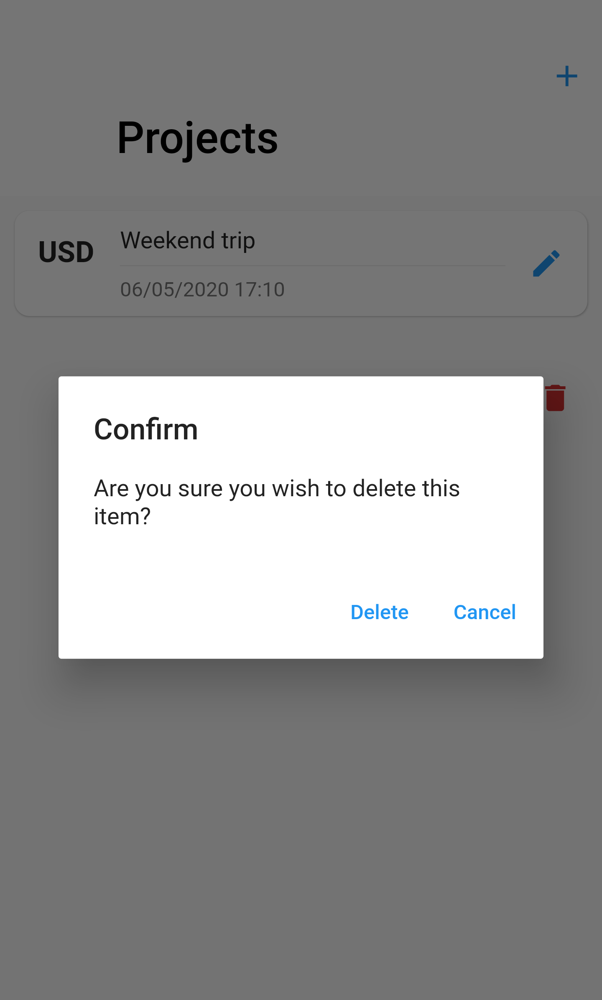

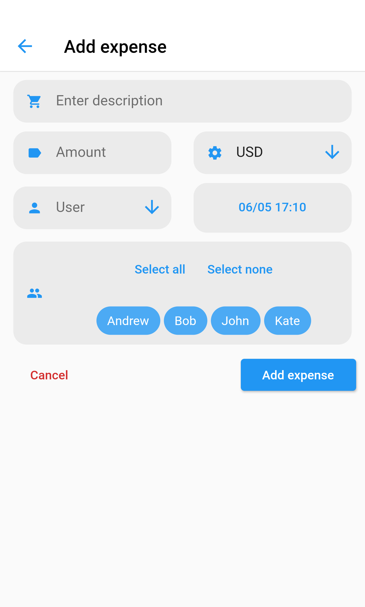
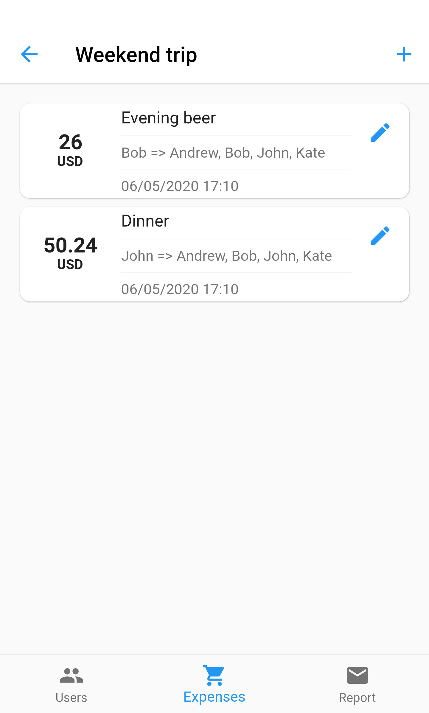
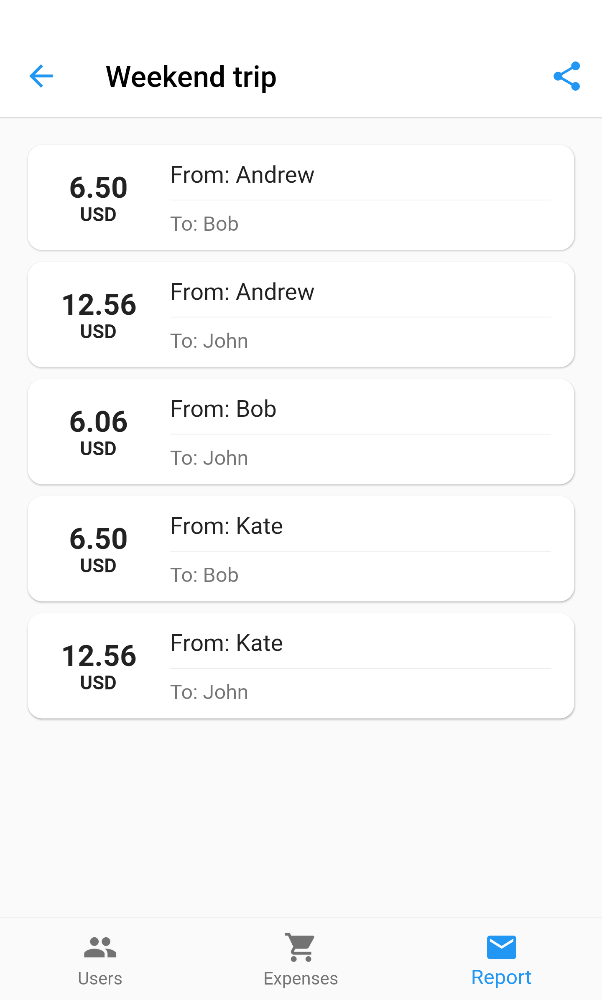

### Android dark theme

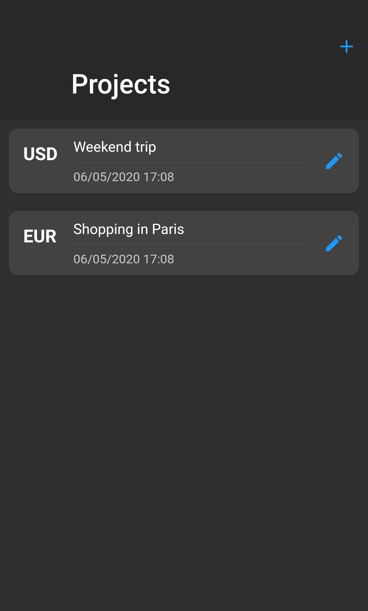

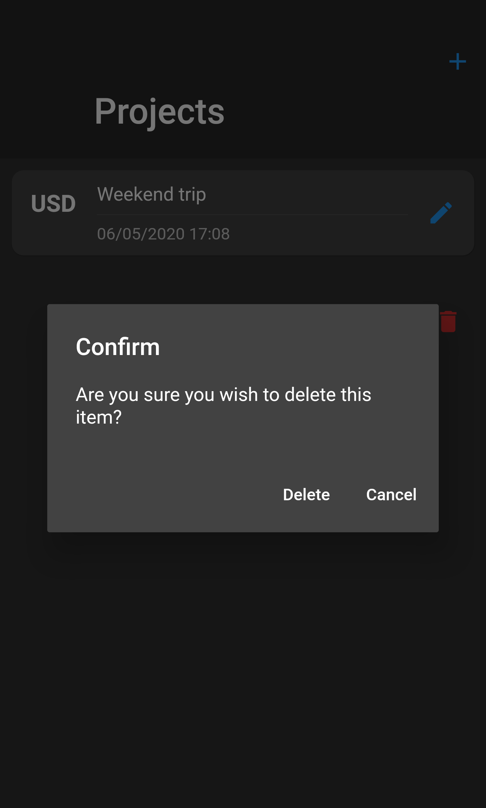

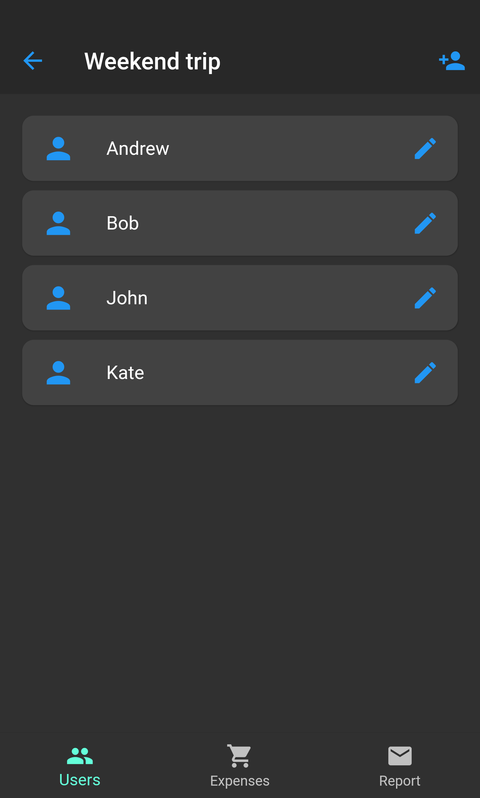
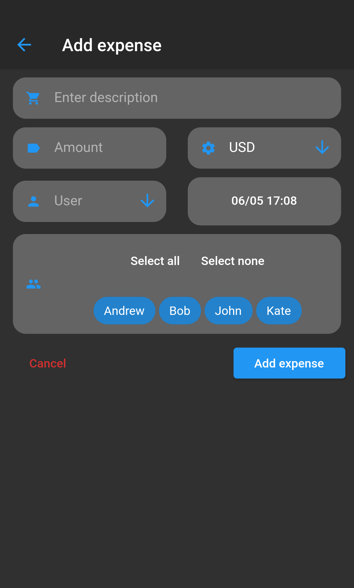
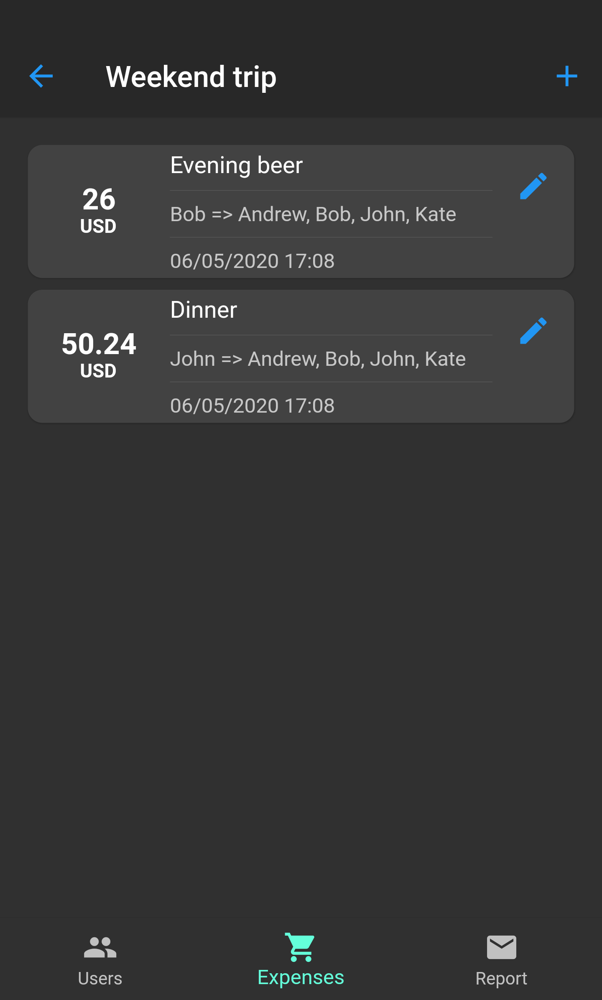
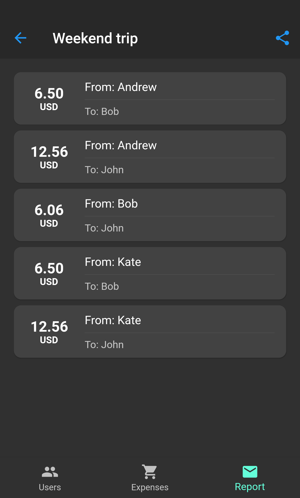

### IOS

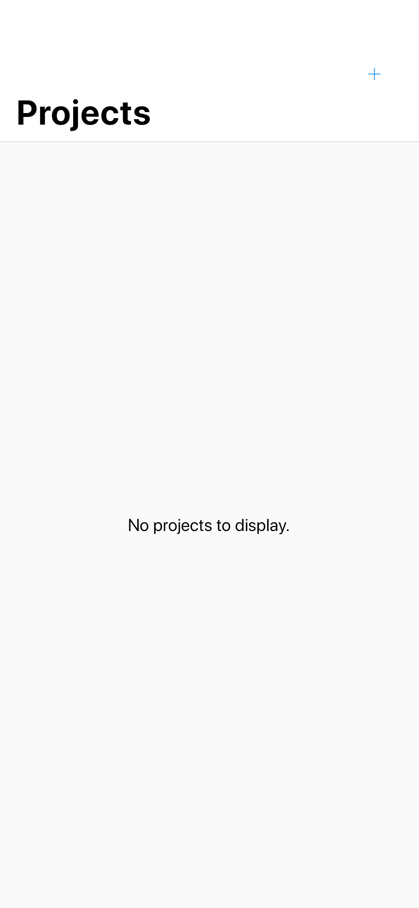
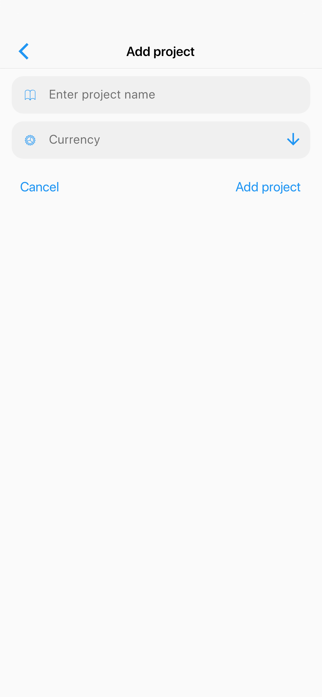

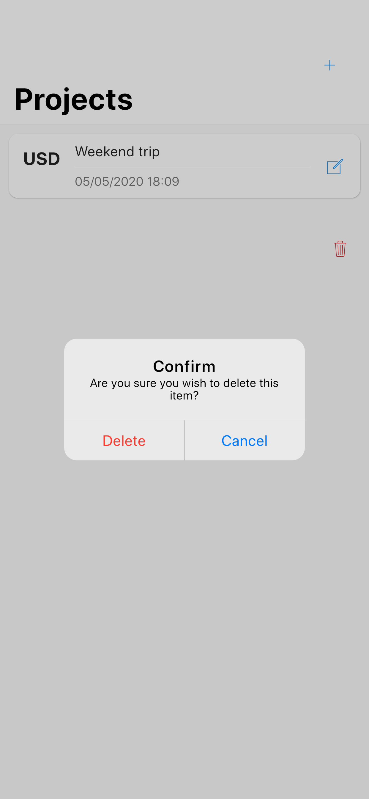
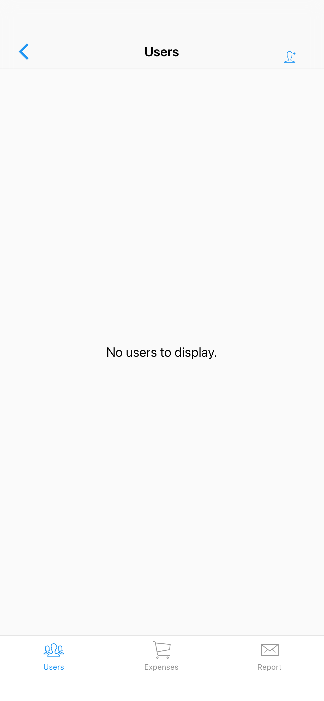

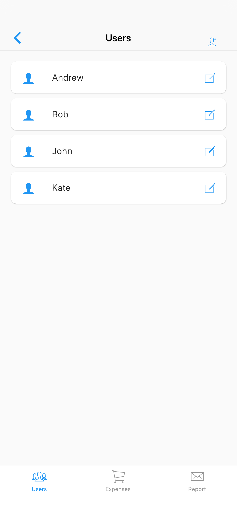
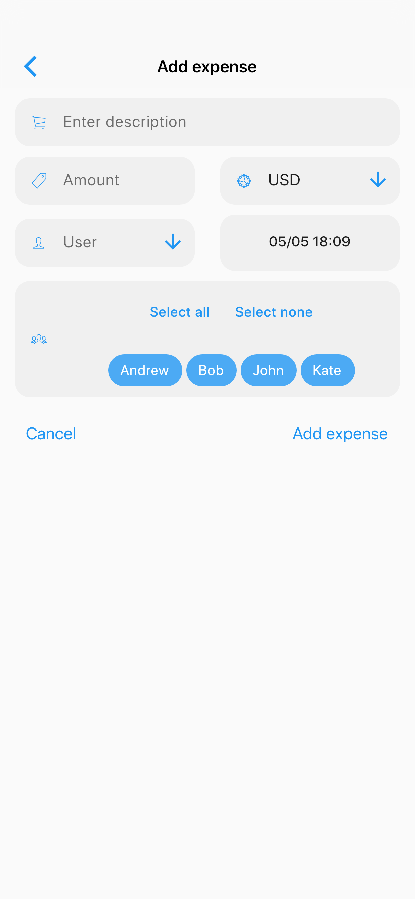
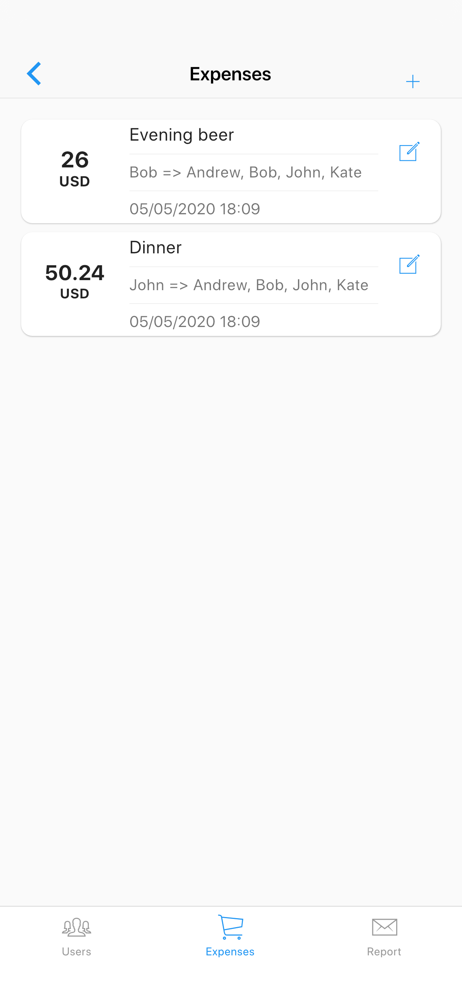
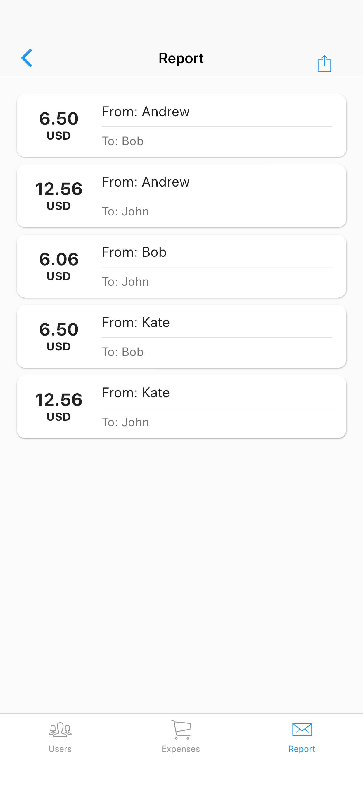

## Some technical details
- I used Hive for data persistence
- I used BloC for state management
- I used get_it package as service locator / dependency injection tool
- Logic fully covered in unit tests
- Widgets and Integration tests also in place when needed
- Integration with Ozzie for taking screenshots during integration tests