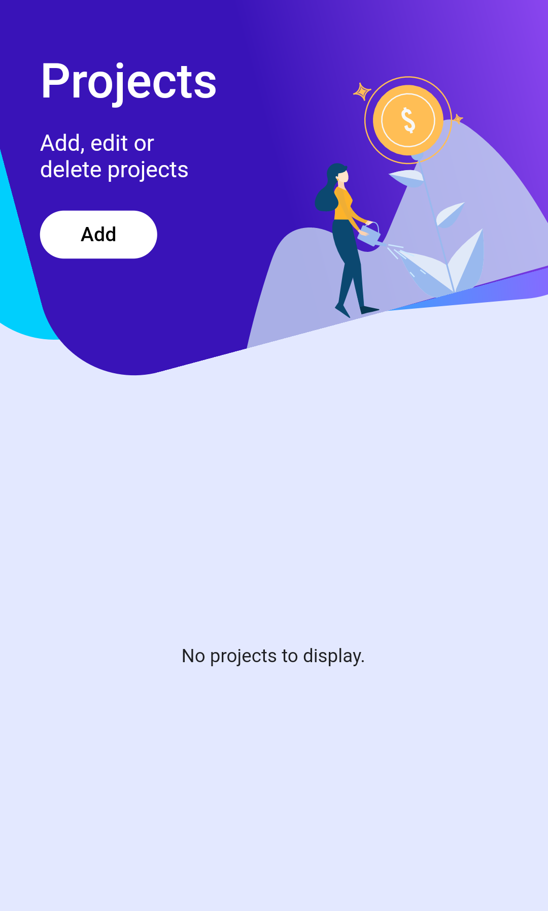
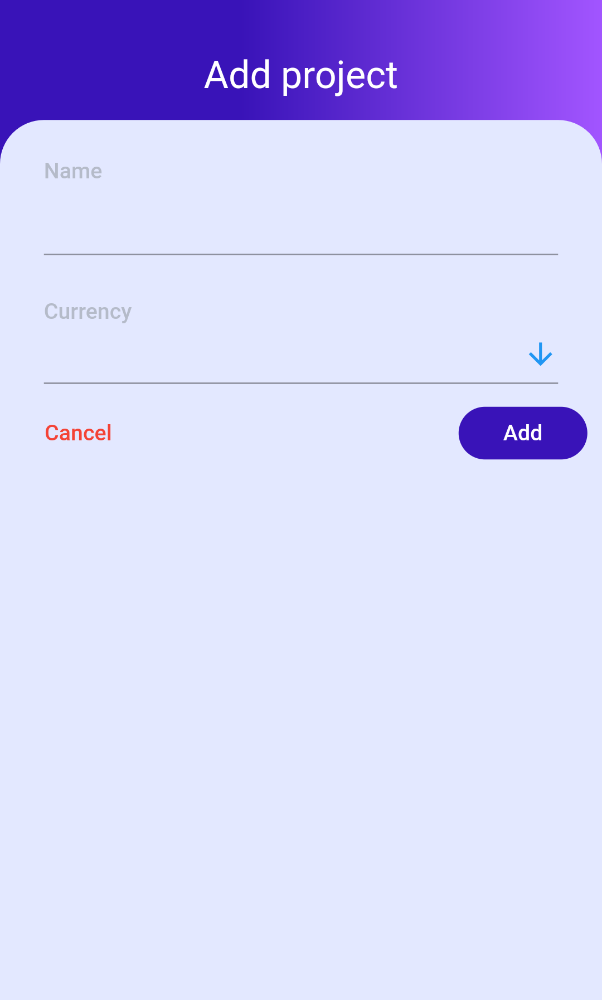
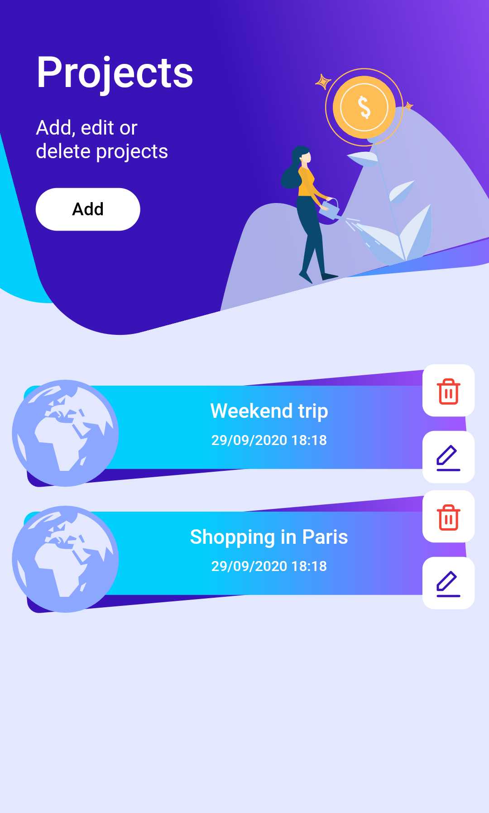
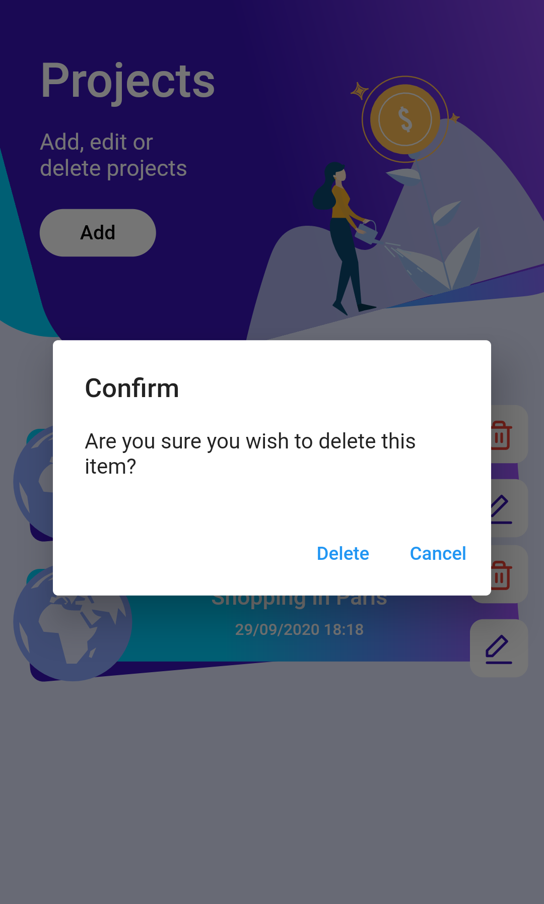
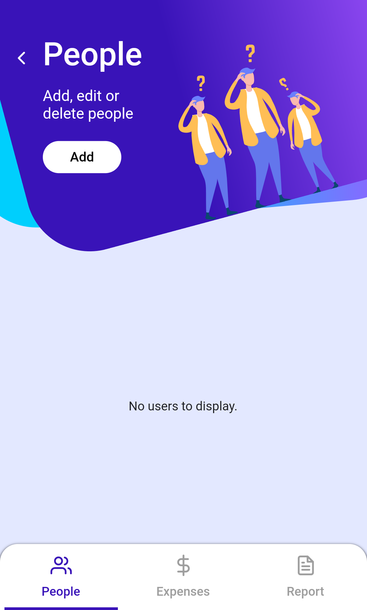
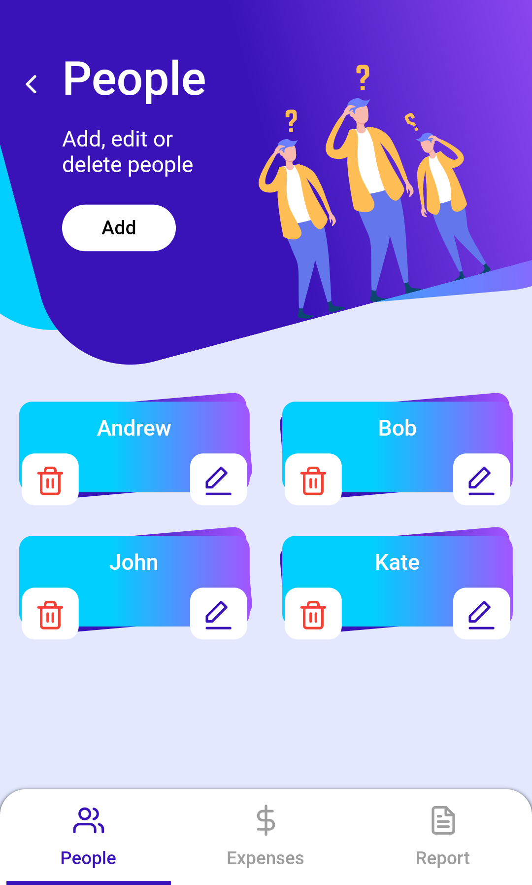
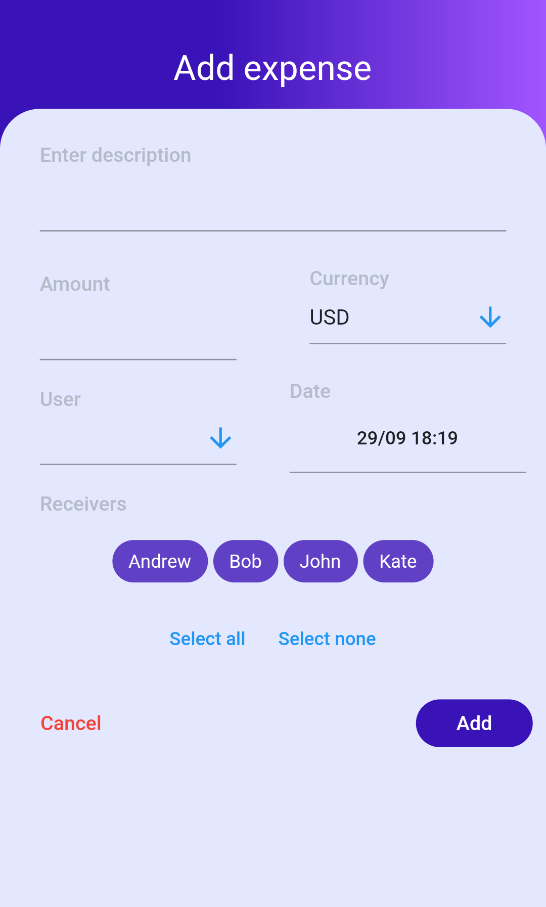
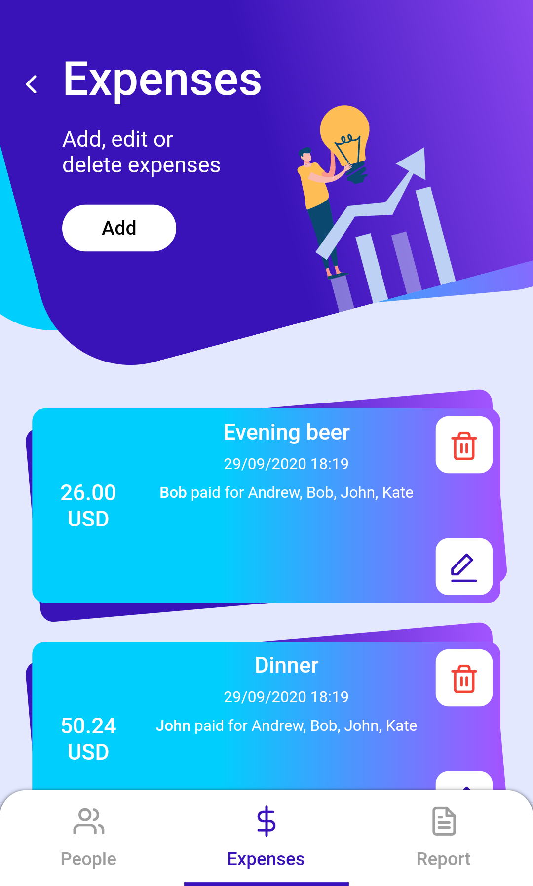
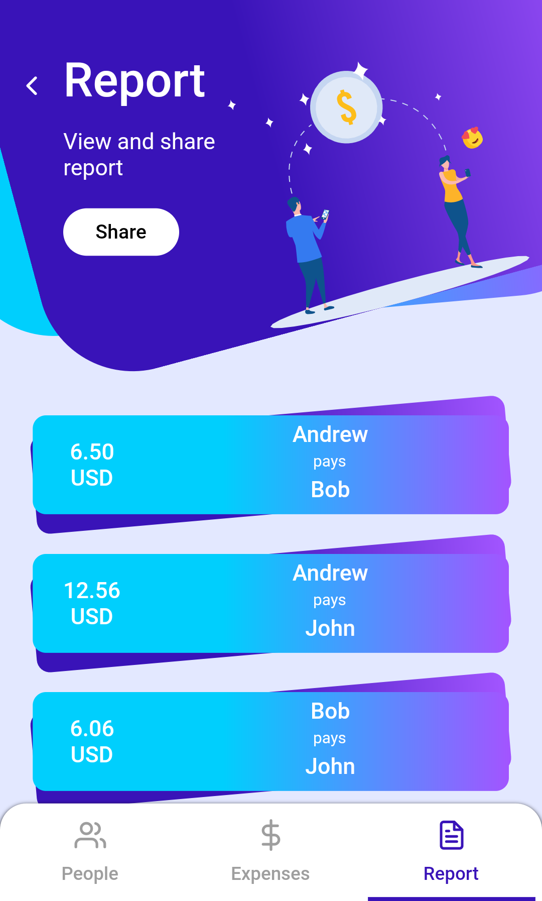

# Costy - group expenses managing app written in Flutter <!-- omit in toc -->

This is a rework of an Android app I wrote some time ago. This time written in Flutter and improved. I used it as my Flutter playground.

- [Functionality](#functionality)
- [Some screenshots](#some-screenshots)
- [Some technical details](#some-technical-details)
- [Running tests](#running-tests)

## Functionality

- Add/modify/delete projects, people and expenses
- Generate and share expense report
- Multi-language (currently Polish and English)
- Work on IOS, Android and Web (although it was not really adjusted to proper Web experience)

## Some screenshots

<p float="left">



</p>

<p float="left">



</p>

<p float="left">




</p>

## Some technical details
- I used Hive for data persistence
- I used BloC for state management
- I used get_it and injectable package as service locator / dependency injection tool
- Logic fully covered in unit tests
- Widgets and Integration tests also in place when needed
- Integration with Ozzie for taking screenshots during integration tests

## Running tests
To run unit and widget tests simply type:
```
flutter test
```
Integration tests are separated into multiple files, one for each category, to run single file type:
```
flutter drive --target=test_driver/projects.dart
or
flutter drive --target=test_driver/users.dart
or
flutter drive --target=test_driver/expenses.dart
or
flutter drive --target=test_driver/report.dart
```
There is one special integration test just for generating screenshots for application:

```
flutter drive --target=test_driver/screenshots.dart
```
In order to run integration test device or emulated must be connected.
You can also run all integration tests on all configured devices using screenshots package [link](https://pub.dev/packages/screenshots). Tu run it, simple type:
```
screenshots
```
